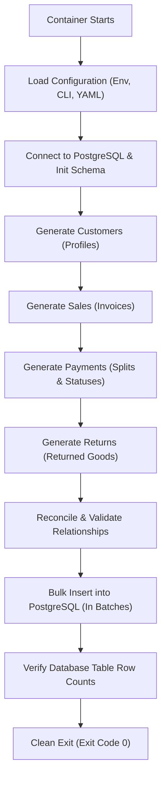

# ARCHITECTURE

This document locks the architecture of the Synthetic Commercial Data Generator.

## 1. Single Authoritative Statement
> The synthetic data generator is a Docker-executed batch service that generates configurable synthetic business datasets and populates PostgreSQL before terminating.

---

## 2. System Overview

This service runs as a one-time utility/batch job. It is not request-driven, service-oriented, or event-driven. It has a single database dependency (PostgreSQL) and does not deploy web APIs (no FastAPI or REST routers are present at runtime).

---

## 3. Component Responsibilities

The codebase is structured under the `synth_data_creator` package:

### 3.1 configuration (`synth_data_creator.core.config`)
- Loads settings from CLI arguments, environment variables, or configuration files (YAML).
- Automatically converts `postgresql://` connection strings to SQLAlchemy async-compatible `postgresql+asyncpg://` scheme.

### 3.2 schema initialization (`synth_data_creator.db.schema_init`)
- Idempotently creates tables and indexes on application startup.
- Automatically installs database extensions (e.g. `pgcrypto` for UUID generation).
- Truncates/drops tables before generation if requested (to ensure fresh data setup).

### 3.3 generation engine (`synth_data_creator.generation`)
- **Customers (`customers.engine`)**: Uses rejection sampling to assign correlated behavioral segments (Whales, Hyper Payers, etc.) and generates profiles.
- **Sales (`sales.engine`)**: Simulates invoice line items, calculating GST taxes and discounts based on seasonal trends and customer sizes.
- **Payments (`payments.engine`)**: Generates transaction records associated with invoices, simulating split payments, payment modes, and delays.
- **Returns (`returns.engine`)**: Simulates product returns/returned goods (RGs) based on product category return probability.

### 3.4 database writer (`synth_data_creator.db.bulk_ops`)
- Performs optimized, low-overhead bulk inserts using SQLAlchemy Core mappings, allowing 100k+ records to be committed in configured batches without memory issues.

---

## 4. Execution Model

- **Batch Lifespan**: Starts, runs, completes, and terminates.
- **No Background Process**: No servers remain running (no Uvicorn, no FastAPI lifespan).
- **Restart Prevention**: Configured with `restart: "no"` in Docker Compose.
- **Error Handling**: Any failure in configuration, generation, db-insertion, or verification returns a non-zero exit code (`1`), halting execution and stopping the container.
