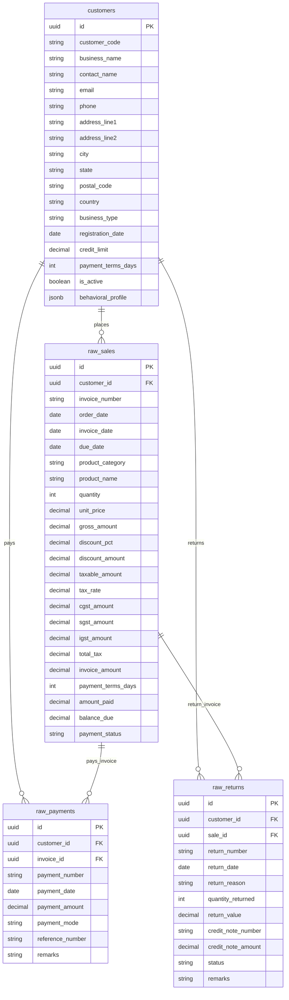

# DATA MODEL

This document defines the schema, relationships, and generation logic for the synthetic datasets.

---

## 1. Entity Overview

The dataset simulates a B2B transaction network consisting of 4 core tables:

---

## 2. Table Specifications

### 2.1 `customers`
Stores client buyer profile metadata and behavioral attributes:
- **`behavioral_profile` (JSONB)**: Contains parameters like `volume_segment` (Whale/Medium/Small), `frequency_segment` (Frequent/Occasional/Seasonal/Rare), `payment_segment` (Hyper/Fast/Moderate/Delayed/Chronic Late), and `discipline_segment` (Disciplined/Moderate/Undisciplined) which drive order frequencies, sizes, payment delays, and return likelihood.
- **`credit_limit`**: Enforced on Whales ($1M - $10M), Medium ($200k - $1.5M), and Small ($25k - $300k) companies.

### 2.2 `raw_sales`
Represents individual B2B sales invoice line items.
- **Taxes**: Automatically calculates CGST, SGST, and IGST based on client state rules (GST default at 18%).
- **Discount**: Evaluated dynamically based on customer volume segment and relationship length.
- **`payment_status`**: Can be `unpaid`, `partial`, `paid`, or `overdue`.

### 2.3 `raw_payments`
Stores payments linked to invoices.
- **Splits**: Multiple payment records can point to a single invoice (representing installment payments).
- **Mode**: Populates mode as `bank_transfer`, `cheque`, `upi`, `neft`, `rtgs`, etc.

### 2.4 `raw_returns` (RG Records)
Stores records of Returned Goods (RGs).
- **Return reason**: Must be one of `damaged_goods`, `delivery_issues`, `quality_defect`, `wrong_product`, `excess_inventory`, `customer_dissatisfaction`, `expired_product`, `pricing_dispute`.
- **Relationship**: Always linked to a valid customer and sales record (cannot exceed original sales invoice quantity).

---

## 3. Relationship and Consistency Rules

To ensure statistical and database integrity, the generator enforces:
1. **Invoice Association**: Every payment and return record is linked to a valid sale invoice via `invoice_id`/`sale_id` and a valid customer via `customer_id`.
2. **Payment Reconciliation**: At the end of generation, the payment fields (`amount_paid`, `balance_due`, `payment_status`) on every sales record are updated to match the sum of actual exported payment records.
3. **Quantity Enforcements**: Returns cannot have a `quantity_returned` higher than the quantity originally purchased on the linked sales record.
4. **GST Consistency**: Taxes are computed and split properly:
   - Intra-state (State matches source): CGST (9%) + SGST (9%).
   - Inter-state (State differs from source): IGST (18%).
